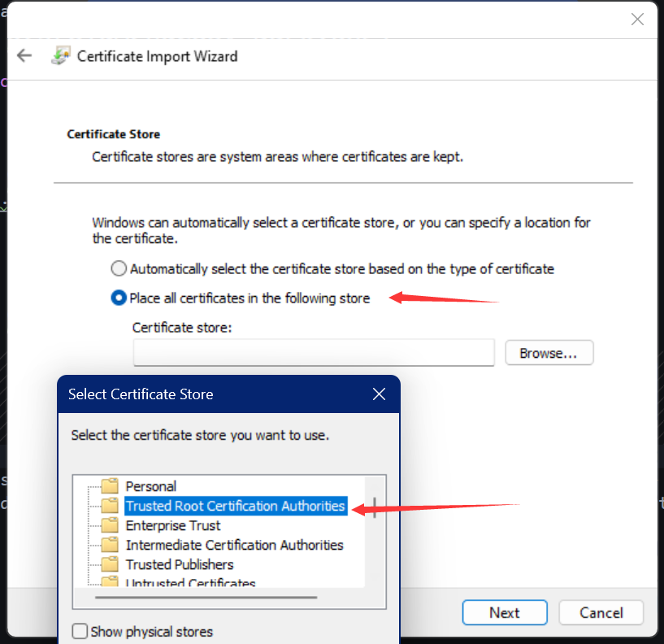
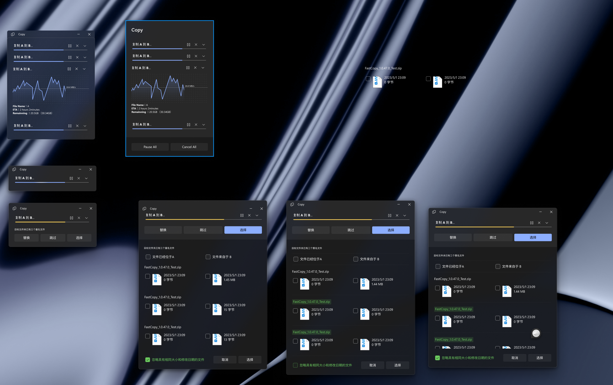

#   FastCopy

A GUI wrapper for Windows' built-in `robocopy` ~~and `xcopy`~~.

## Features
- Easy to use copy/paste/move/delete dialog, just like your good old explorer, but much faster🚀

- Support the new Windows 11 context menu, and the old windows context menu, with the fluent design icon adapted to Light/Dark theme

<p align="center">
    <image src="Screenshots/NewMenuCopy_Dark.png">
</p>

<p align="center">
    <image src="Screenshots/NewMenuCopy_Light.png">
</p>

<p align="center">
    <image src="Screenshots/NewMenuPaste_Dark.png">
</p>

<p align="center">
    <image src="Screenshots/OldMenuCopy_Dark.png">
</p>


- Integration with Windows Notification Center: a notification toast will pop up when the copy is finished

<p align="center">
    <image src="Screenshots/notification.png">
</p>

- Speed graph

<p align="center">
    <image src="Screenshots/speed-graph.png">
</p>

- Confirmation Dialog
<p align="center">
    <image src="Screenshots/confirmation-dialog.png">
</p>

- Integration with taskbar: a progress bar sync with the one inside the window

<p align="center">
    <image src="Screenshots/taskbar-icon.png">
</p>

- Settings

<p align="center">
    <image src="Screenshots/settings.png">
</p>

- Multi-language support
  + English
  + 中文

## Installation (before publish to Microsoft Store)
1. Go to the [Release Page](https://github.com/HO-COOH/FastCopy/releases), download the zip file in the **Asset** section of the latest version
2. Unzip, double-click to open the certificate file ended in `.cert`, click `Install Certificate`. Choose `Local Machine` in the dialog, click `Next`
  
3. Choose `Place all certificates in the following store`, click `Browser`, and in the dialog choose `Trusted root certification authorities`

4. Then click `Next` and finally `Finish` to install the certificate.
5. Now you can double-click the `msix` to install the app.
6*. **In rare situations, you might need to restart `explorer.exe` to see `FastCopy` in the right-click context menu**

## Usage
1. Using file explorer, select some files/folders, as many as you want >> right click >> move to **FastCopy** >> select **Copy** or **Move**
2. Go to destination folder, right click at empty space >> move to **FastCopy** >> select **Paste**


## Development
### Project structure
```
FastCopy
    FastCopy\               --- Main project
    FastCopyShellExtension\ --- A dll project for registering the new Windows context menu
    SpeedTest\              --- A speed test project for measuring various copying method under Windows
    UnitTest\               --- Unit test for above projects
    FastCopy.sln            --- The solution file for all the projects
```
### Build pre-requisites
- Visual Studio 2019+, with C++20 support & Universal Windows development workload
- Windows App Sdk, with C++ template
- Additional dependencies per project:
  + FastCopy:
    - spdlog
    - boost-algorithm
  + SpeedTest:
    - abseil
    - ftxui

[vcpkg](https://vcpkg.io/en/) is the recommended package manager to handle these dependencies. 
You can install them with one command, and do no more.
```
vcpkg install boost-algorithm:x64-windows
vcpkg install spdlog:x64-windows
vcpkg install abseil:x64-windows
vcpkg install ftxui:x64-windows
``` 
### Known issue
- App crash after the window closed (does not affect users, low priority)

### Recommendation
Please install the [Child Process Debugger](https://marketplace.visualstudio.com/items?itemName=vsdbgplat.MicrosoftChildProcessDebuggingPowerTool2022), so that the debugger would break at the copying process (after you launch the settings process). 
That is, you run the program first (so it goes into settings), then copy-paste a file, then the debugger will break automatically. 
Strongly recommended! 

## Translation
For contribution to translation, there are 2 places to be translated:
- The main project, in `FastCopy/Strings/<language>/Resources.resw`
- The shell extension project, in `FastCopyShellExtension/CopyOperationNames.cpp CopyOperationNames::GetInstance()`

### Prototype
[Figma link, you may need to ask for permission.](https://www.figma.com/file/e5hUvDWKO8gZiKXruuNSvL/Xcopy?type=design&node-id=217-31199&t=cKY9TdBJXXi7QdFL-0)




